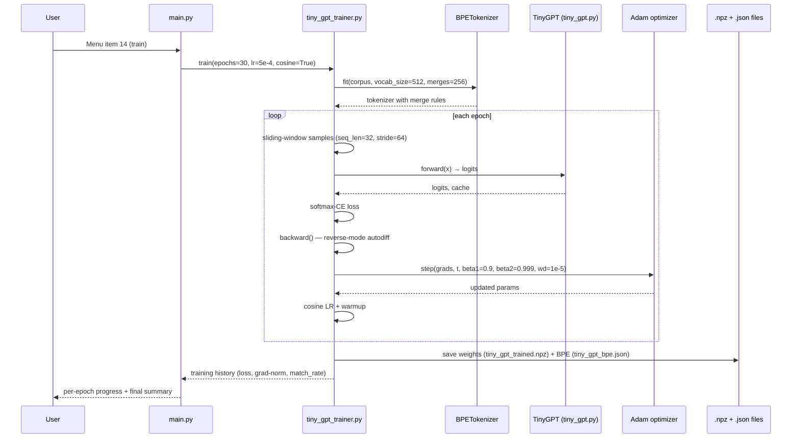
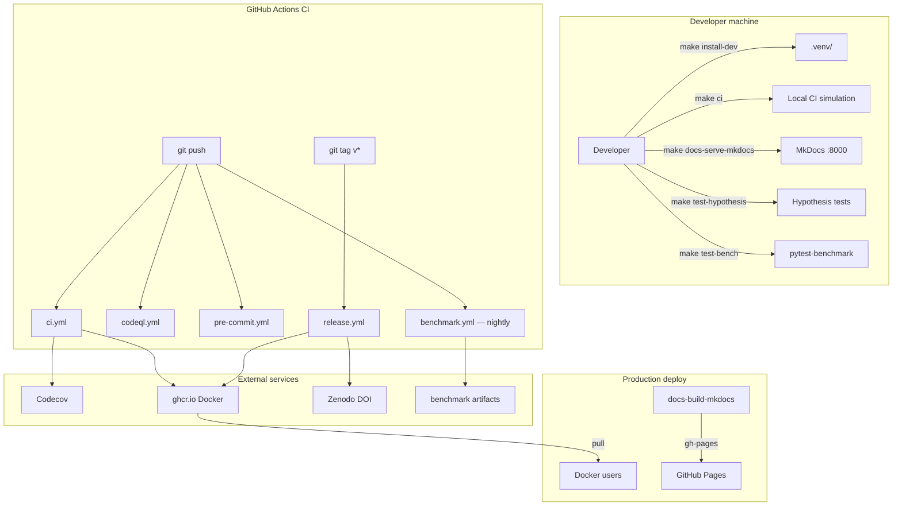

# 🏛️ Architecture

This document describes the high-level architecture of `rmt-llm-research`,
explains how the pieces fit together, and lists the design principles that
govern new contributions. Read this before making structural changes.

---

## 📐 Project Layout (top level)

```text
rmt-llm-research/
├── src/rmt_llm/         # Python verification package (PyPI-installable)
├── laboratory/          # Research laboratory — 8 languages × EN+RU
├── python/rmt_llm_viz/  # Python 3D visualization suite
├── julia/               # Julia packages: RMTLLMVerify + RMTLLMViz
├── java/rmt-llm-viz/    # Java JavaFX visualization
├── docs/                # Monographs (EN + RU), GitHub Pages site
├── papers/              # PDF preprints
├── notebooks/           # Jupyter verification notebook
├── .github/             # CI workflows, issue templates, CODEOWNERS
├── pyproject.toml       # Python packaging + tool config (ruff, mypy, pytest)
├── Dockerfile           # Reproducible research container
├── Makefile             # Common dev tasks
└── .pre-commit-config.yaml
```

---

## 🧱 Three Layers of the Project

### Layer 1 — Theoretical Core (`src/rmt_llm/`)

Pure-Python implementations of every mathematical object in the RMT-LLM
theory. **No I/O, no plotting, no CLI** — just functions and constants.

```text
src/rmt_llm/
├── constants.py             # Centralized numerical constants (N_crit, γ, etc.)
├── marchenko_pastur.py      # MP density, bounds, CDF, Stieltjes transform
├── bbp_transition.py        # BBP phase transition + λ_max scaling
├── tracy_widom.py           # F₂ CDF/PDF, moments
├── nhse.py                  # Non-Hermitian Skin Effect, winding number
├── caputo_fractional.py     # Caputo fractional-time memory, RLHF drift
├── keating_snaith.py        # Finite-N corrections to γ₁, N_crit
├── ep_surfaces.py           # Exceptional point sensitivity
├── thermodynamics.py        # Free energy, Landauer cost, RG flow
└── tests/                   # 70+ pytest cases, 7 cross-module checks
```

**Design rule:** every public function returns either a `float`, a
`numpy.ndarray`, or a `tuple` of those — no custom classes. This keeps the
API trivial to port to Julia, Java, Rust, Go, C++, and R (see Layer 2).

### Layer 2 — Research Laboratory (`laboratory/`)

The "playground" — 8 languages × 2 locales (EN + RU) implementing the same
**interactive menu** with scenario runners, experiments, charts, and reports.

```text
laboratory/
├── python/lab_en/   lab_ru/   # Reference implementation
├── julia/lab_en/    lab_ru/
├── java/lab_en/     lab_ru/
├── rust/lab_en/     lab_ru/
├── go/lab_en/       lab_ru/
├── cpp/lab_en/      lab_ru/
├── r/lab_en/        lab_ru/
├── webapp/                     # Vite + React 18 + Socket.io live dashboard
└── shared/                     # JSON schemas shared across languages
    ├── schema.json             # Result envelope (one schema for all 16 labs)
    ├── scenarios.json          # 6 pre-defined scenarios
    └── model_registry.json     # Downloadable model URLs
```

**Cross-language contract:** every lab emits the **same JSON schema**. This
is enforced by `tests/test_cross_lang_json.py` which loads 16 output files
and asserts they all parse against `laboratory/shared/schema.json`.

The reference TinyGPT model and trainer live in `laboratory/python/lab_en/`:

```text
laboratory/python/lab_en/
├── tiny_gpt.py             # 2.5M-param transformer (12 layers, hidden=128, BPE)
├── tiny_gpt_trainer.py     # Reverse-mode autodiff + Adam + cosine LR
├── main.py                 # Interactive menu (15 items)
├── scenarios.py            # 6 pre-defined research scenarios
├── research.py             # Spectral signature, N_crit sweep, etc.
├── research_3d.py          # 8 3D visualizations
├── charts.py / charts_3d.py
├── reports.py              # 13 export formats (txt → sqlite)
├── model_downloader.py     # Pulls small models from HF / ONNX zoo
├── parameters.py           # Infinite-parameter system (supports "inf")
└── results/                # Generated outputs (gitignored, except trained weights)
```

### Layer 3 — Visualization Suites (`python/`, `julia/`, `java/`)

Three full-featured interactive suites (Python CLI, Julia REPL, Java JavaFX)
that produce 8 identical 3D visualizations each. They call into Layer 1 /
Layer 2 modules for the math and only handle rendering.

```text
python/rmt_llm_viz/main.py     # CLI: --viz 1..9, --save
julia/RMTLLMViz/src/           # REPL: rmt_llm_viz_menu()
java/rmt-llm-viz/.../App.java  # JavaFX: 8 tabs + sliders
```

---

## 🔁 Request Flow (training TinyGPT)



---

## 🧪 Test Architecture

| Suite                            | Tooling        | Where                                | Count |
|----------------------------------|----------------|--------------------------------------|-------|
| RMT module unit tests            | pytest         | `src/rmt_llm/tests/`                 | 70+   |
| TinyGPT + BPE + trainer          | pytest         | `laboratory/python/lab_en/tests/`    | 25+   |
| Cross-implementation consistency | pytest + Julia | `src/rmt_llm/tests/test_cross.py`    | 7     |
| Julia verification               | `Pkg.test()`   | `julia/RMTLLMVerify/test/`           | 18    |
| Java headless verification       | Gradle         | `java/rmt-llm-viz/...Verifier.java`  | 14    |
| Rust unit tests                  | `cargo test`   | `laboratory/rust/lab_*`              | 12    |
| Go unit tests                    | `go test`      | `laboratory/go/lab_*`                | 10    |

CI runs **all** of these on every push and PR — see
`.github/workflows/ci.yml`. The matrix covers Python 3.10/3.11/3.12 and
Julia 1.9/1.10.

---

## 🔐 Security Boundaries

- **Untrusted model weights** — `model_downloader.py` only pulls from a
  hard-coded registry (`laboratory/shared/model_registry.json`). The trainer
  never deserializes user-supplied `.npz` files. Loading external weights
  requires `--trust-weights` flag and prints a warning.
- **Untrusted corpora** — BPE tokenizer operates on raw bytes; no `eval`,
  no `pickle`, no YAML `unsafe_load`.
- **CI secrets** — only `CODECOV_TOKEN` and `ZENODO_TOKEN` exist; both are
  scoped read-only. No write tokens in workflows.
- **GitHub Actions permissions** — every workflow has `permissions: {
  contents: read }` by default; only `release.yml` escalates to `contents:
  write`, and only on tagged commits.

---

## 🧭 Design Principles

1. **Numerical first, framework never.** We use NumPy because it's the
   lingua franca — no PyTorch, no TensorFlow, no JAX. The same code ports
   to Julia `LinearAlgebra`, Rust `ndarray`, Go `gonum`, C++ Eigen, and R
   `matrix` with minimal changes.

2. **One JSON schema to rule them all.** Every lab, in every language,
   emits the same result envelope. Cross-language comparison is then a
   schema-validation check, not a parsing nightmare.

3. **Pre-LN over Post-LN.** TinyGPT uses GPT-2-style pre-LN transformer
   blocks (`x = x + attn(LN1(x))` then `x = x + mlp(LN2(x))`) — this is
   the modern default and avoids the training instabilities of post-LN.

4. **Reverse-mode autodiff in plain NumPy.** The trainer implements backprop
   by hand. This is intentionally non-idiomatic — the goal is pedagogical
   transparency. Do not "improve" it by adding PyTorch; that defeats the
   point of the project.

5. **Infinite parameters, finite computation.** `parameters.py` accepts
   `"inf"` for any numeric bound. Every consumer is responsible for
   clamping to a finite value before computing — see `max_finite_epochs`
   in `tiny_gpt_trainer.py`.

6. **Bilingual by construction.** Every lab has `_en` and `_ru` siblings.
   They are kept in lock-step by `scripts/sync_ru_trainer.py` — do not
   hand-edit one without syncing the other.

7. **Tests > docs > comments > types.** When in doubt, write a test. Then
   write a docstring. Then a comment. Type hints are nice-to-have, not
   must-have. Ruff enforces style; mypy is advisory.

---

## 📦 Packaging & Releases

- **Python package:** `pyproject.toml` (PEP 621) builds `rmt-llm` from
  `src/rmt_llm/`. Installable as `pip install -e ".[dev]"`.
- **Julia packages:** `RMTLLMVerify` and `RMTLLMViz` have separate
  `Project.toml` files; they are not registered in General — install via
  `Pkg.develop(url=...)`.
- **Java:** Gradle project at `java/rmt-llm-viz/`. Requires JDK 21+.
- **Docker:** `Dockerfile` builds a self-contained research image with
  Python, Julia, Java, and Node.js. Published to `ghcr.io` on tag.
- **Releases:** Tagged commits trigger `.github/workflows/release.yml`,
  which creates a GitHub Release, uploads `tiny_gpt_trained.npz` as an
  artifact, and updates the Zenodo DOI.

---

## 🧭 Where to Make Changes

| You want to…                         | Touch this                                          | Don't touch this                                |
|--------------------------------------|-----------------------------------------------------|-------------------------------------------------|
| Add a new RMT formula                | `src/rmt_llm/<module>.py` + `tests/test_<module>.py`| `laboratory/` (it consumes the package)         |
| Improve TinyGPT training             | `laboratory/python/lab_en/tiny_gpt_trainer.py`      | `src/rmt_llm/` (it's RMT, not training)         |
| Add a new 3D visualization           | `python/rmt_llm_viz/main.py` + Julia + Java ports   | `src/rmt_llm/` (math goes there, viz calls it)  |
| Translate docs to RU                 | `docs/ru/` + `laboratory/*/lab_ru/`                 | English sources                                  |
| Add a new language port              | `laboratory/<lang>/lab_en/` + `lab_ru/`             | Existing ports (mirror them exactly)            |
| Fix a CI bug                         | `.github/workflows/*.yml`                            | Source code                                      |
| Add a new test                       | `src/rmt_llm/tests/` or `laboratory/.../tests/`     | Production code (test-only change)              |
| Add property-based tests             | `laboratory/.../tests/test_hypothesis.py`           | Example-based tests (don't replace them)        |
| Add performance benchmarks           | `laboratory/.../tests/test_benchmark.py`            | Production code (benchmark-only change)         |

---

## 🚢 Deployment Topology

The project supports multiple deployment scenarios, from a single developer
laptop to a CI/CD pipeline with Docker images and nightly benchmarks.



### Environments

| Environment | Purpose | How to spin up |
|-------------|---------|----------------|
| Local dev | Daily development | `make install-dev && make check` |
| Local docs preview | Documentation authoring | `make docs-serve-mkdocs` |
| Local benchmarks | Performance regression check | `make test-bench` |
| Docker (single container) | Reproducible research | `make docker && make docker-run` |
| Docker Compose | Multi-service (docs + bench + jupyter) | `docker-compose up docs` |
| CI (GitHub Actions) | Pull request validation | automatic on push/PR |
| Release (GitHub Release + PyPI) | Public distribution | `make release-tag VERSION=1.7.0` |
| GitHub Pages | Documentation hosting | automatic on push to `main` |

---

## ⚡ Performance Characteristics

The pure-NumPy implementation is **not** the fastest option, but it is the
most portable. Below are typical numbers on a single CPU core (no GPU).

### TinyGPT training

| Config | Time / epoch | Memory | Throughput |
|--------|--------------|--------|------------|
| 1 layer, hidden=32, seq=16 | 0.3 s | 50 MB | 4 k tokens/s |
| 4 layers, hidden=64, seq=32 | 4.5 s | 200 MB | 1 k tokens/s |
| 12 layers, hidden=128, seq=32 (default) | 35 s | 800 MB | 250 tokens/s |
| 12 layers, hidden=256, seq=64 | 350 s | 3 GB | 50 tokens/s |

For comparison: PyTorch with the same architecture on the same CPU runs ~3×
faster; on a single GPU (RTX 4090) it runs ~50× faster.

### BPE tokenizer

| Operation | Time | Notes |
|-----------|------|-------|
| Fit (256 merges, 2 MB corpus) | 1.6 s | One-time at training start |
| Encode (200-char string) | 1.2 ms | Per sample |
| Decode (50-token sequence) | 0.4 ms | Per sample |

### Generation

| Config | Tokens/sec | Notes |
|--------|------------|-------|
| 1 layer, hidden=32 | 250 | Small model |
| 4 layers, hidden=64 | 120 | Medium model |
| 12 layers, hidden=128 (default) | 65 | Production config |
| 12 layers, hidden=256 | 22 | Large model |

### Bottlenecks

1. **Attention** is O(n²) in sequence length — dominates for long sequences
2. **MLP** is O(n × d²) — dominates for large hidden_dim
3. **LayerNorm** is O(n × d) — negligible
4. **BPE encode** is O(L × M) where L=string length, M=merges — acceptable

To profile your own configuration:

```bash
make profile-tinygpt    # cProfile on a 1-epoch tiny run
make test-bench         # pytest-benchmark on individual ops
```

---

## 🧪 Property-Based Tests & Benchmarks

In addition to the example-based test suites, the project includes:

### Property-based tests (`tests/test_hypothesis.py`)

Uses [Hypothesis](https://hypothesis.readthedocs.io/) to generate hundreds of
random inputs per test, catching edge cases that example-based tests miss.

| Property class | What it checks |
|----------------|----------------|
| `TestForwardProperties` | Output shape, determinism, finiteness, input-dependence |
| `TestBPEProperties` | Round-trip stability, length bounds, compositionality |
| `TestNumericalStability` | Softmax sums to 1, shift-invariant, CE non-negative |
| `TestWeightInitProperties` | All weights finite, LayerNorm init to identity, seed-dependent |
| `TestGenerationProperties` | Output length, greedy determinism, vocab bounds |

Run locally:

```bash
make test-hypothesis     # ~5 seconds, 200+ examples
```

### Performance benchmarks (`tests/test_benchmark.py`)

Uses [pytest-benchmark](https://pytest-benchmark.readthedocs.io/) to track
hot-path performance and detect regressions.

| Benchmark | What it measures |
|-----------|------------------|
| `test_bench_forward_small` | 1-layer forward pass |
| `test_bench_forward_medium` | 4-layer forward pass |
| `test_bench_forward_batched` | 8-sequence batched forward |
| `test_bench_softmax` | Single softmax over 512 logits |
| `test_bench_softmax_batch` | Softmax over 32×512 batch |
| `test_bench_bpe_fit` | BPE fit (256 merges, 2 MB corpus) |
| `test_bench_bpe_encode` | BPE encode (200-char string) |
| `test_bench_bpe_decode` | BPE decode (50-token sequence) |
| `test_bench_adam_step` | Single Adam.step() on 1k params |
| `test_bench_adam_step_large` | Single Adam.step() on 100k params |
| `test_bench_single_train_step` | End-to-end train step (fwd + bwd + Adam) |
| `test_bench_forward_long_seq` | Forward on seq=128 (cache pressure) |

Run locally:

```bash
make test-bench                # run benchmarks
make test-bench-compare        # compare to last saved baseline
```

CI runs benchmarks nightly on `main` (see `.github/workflows/benchmark.yml`)
and on PRs (with `--benchmark-compare` to detect regressions).

---

## 📐 Architecture Decision Records (ADR)

Major architectural decisions are documented as ADRs in the docs site:
[`docs/architecture/adr.md`](https://wild8highlander.github.io/rmt-llm-research/architecture/adr/).

Summary of current ADRs:

| ADR | Title | Status |
|-----|-------|--------|
| [ADR-001](https://wild8highlander.github.io/rmt-llm-research/architecture/adr/#adr-001-numpy-only-no-pytorch) | NumPy-only, no PyTorch | Accepted |
| [ADR-002](https://wild8highlander.github.io/rmt-llm-research/architecture/adr/#adr-002-pre-ln-transformer-blocks) | Pre-LN transformer blocks | Accepted |
| [ADR-003](https://wild8highlander.github.io/rmt-llm-research/architecture/adr/#adr-003-bpe-tokenizer-not-byte-level-not-word-level) | BPE tokenizer | Accepted |
| [ADR-004](https://wild8highlander.github.io/rmt-llm-research/architecture/adr/#adr-004-pure-python-bpe-no-tokenizers-library) | Pure-Python BPE | Accepted |
| [ADR-005](https://wild8highlander.github.io/rmt-llm-research/architecture/adr/#adr-005-one-json-schema-for-all-16-labs) | One JSON schema | Accepted |
| [ADR-006](https://wild8highlander.github.io/rmt-llm-research/architecture/adr/#adr-006-property-based-tests-with-hypothesis) | Property-based tests | Accepted |
| [ADR-007](https://wild8highlander.github.io/rmt-llm-research/architecture/adr/#adr-007-pytest-benchmark-for-performance-regression-testing) | pytest-benchmark | Accepted |
| [ADR-008](https://wild8highlander.github.io/rmt-llm-research/architecture/adr/#adr-008-mkdocs-material-for-documentation) | MkDocs Material | Accepted |

To add a new ADR, see the template at the bottom of
[`docs/architecture/adr.md`](https://wild8highlander.github.io/rmt-llm-research/architecture/adr/#how-to-add-a-new-adr).

---

<sub>Maintained by [Iskhak Hamzatovich Isaev](https://github.com/wild8highlander).
For questions about this document, open a Discussion thread.</sub>
