# 🧠 RMT & LLM Research: Random Matrix Theory Meets Large Language Models

[](https://creativecommons.org/licenses/by-nc-sa/4.0/)
[](./docs/)
[](./papers/)
[]()
[](https://doi.org/10.5281/zenodo.21825389)
[](https://orcid.org/0009-0003-7299-0701)
[](https://securityscorecards.dev/viewer/?uri=github.com/wild8highlander/rmt-llm-research)
[](https://codecov.io/gh/wild8highlander/rmt-llm-research)
[](./src/rmt_llm/tests/)
[](./julia/RMTLLMVerify/)
[](./java/rmt-llm-viz/)
[](./python/rmt_llm_viz/)
[](./julia/RMTLLMViz/)

> **Spectral analysis of LLM activations through the lens of Random Matrix Theory** — detecting hallucinations, cognitive mode transitions, and the mathematical inevitability of autoregressive collapse.

---

## 📑 Table of Contents

- [Overview](#-overview)
- [Research Topics](#-research-topics)
- [Repository Structure](#-repository-structure)
- [Verification Package](#-verification-package)
- [Advanced Visualization Suites](#-advanced-visualization-suites)
- [Documents](#-documents)
- [Papers](#-papers)
- [Key Results](#-key-results)
- [Getting Started](#-getting-started)
- [Citation](#-citation)
- [License](#-license)

---

## 🧭 Overview

This repository presents a comprehensive research program applying **Random Matrix Theory (RMT)** to the analysis of large language models (LLMs). The work spans three interconnected areas:

1. **Spectral analysis of LLM activations** — using Marchenko-Pastur law, BBP phase transition, and Tracy-Widom distribution to distinguish factual from creative generation
2. **Mathematical proof of inevitable hallucinations** — 10 independent paths to N_crit through NHSE, Caputo fractional dynamics, EP-surfaces, and Keating-Snaith corrections
3. **Thermodynamic analogy** — free energy F = U − T·S_spec, renormalization group flow across transformer layers, and the Landauer principle for autoregressive irreversibility

---

## 🔍 Research Topics

### 1. Spectral Statistics of LLM Activations
Covariance matrices of GPT-2 hidden-state activations exhibit fundamentally different spectral properties depending on whether the model is in factual recall or creative generation mode. The BBP phase transition, Marchenko-Pastur bounds, and Tracy-Widom fluctuations provide quantitative markers for cognitive mode detection.

### 2. Inevitable Hallucinations in Autoregressive Models
Ten independent mathematical paths converge on a single critical token count N_crit: complex phase, operator dynamics, GUE spectral statistics, thermodynamic entropy, Lévy-Langevin fractional dynamics, EP-surfaces, Tracy-Widom, quantum channel degradation, NHSE (winding number), and Caputo fractional-time memory.

### 3. The Utility Trap: RLHF and Entropic Collapse
RLHF optimization creates an artificial drift in the Fokker-Planck equation, forcing the model to "lie beautifully once" rather than risk a self-correction cycle. The Caputo memory parameter β ≈ 0.5 makes 〈T_crit〉 ∝ (μ_eff)⁻² — even small RLHF pressure quadratically accelerates hallucination onset.

---

## 📁 Repository Structure

```mermaid
graph TD
    A[rmt-llm-research] --> B[docs/]
    A --> C[src/rmt_llm/]
    A --> D[julia/RMTLLMVerify/]
    A --> E[notebooks/]
    A --> F[papers/]
    A --> G[.github/workflows/]
    A --> P[python/rmt_llm_viz/]
    A --> J[julia/RMTLLMViz/]
    A --> K[java/rmt-llm-viz/]

    B --> B1[en/ — 6 English DOCX]
    B --> B2[ru/ — 6 Russian DOCX]
    B --> B3[site/ — GitHub Pages + Demo]

    C --> C1[marchenko_pastur.py]
    C --> C2[bbp_transition.py]
    C --> C3[tracy_widom.py]
    C --> C4[nhse.py]
    C --> C5[caputo_fractional.py]
    C --> C6[keating_snaith.py]
    C --> C7[ep_surfaces.py]
    C --> C8[thermodynamics.py]
    C --> C9[constants.py]
    C --> C10[tests/ — 70+ pytest tests]

    D --> D1[src/ — Julia module]
    D --> D2[test/ — Julia test suite]

    E --> E1[rmt_llm_verification.ipynb]

    G --> G1[ci.yml — Python+Julia CI]
    G --> G2[scorecard.yml — OpenSSF]
    G --> G3[zenodo.yml — DOI archive]
    G --> G4[deploy-docs.yml — Pages]

    P --> P1[main.py — Interactive CLI menu]
    P --> P2[8 3D visualizations + dashboard]

    J --> J1[RMTLLMViz.jl — Interactive REPL]
    J --> J2[8 3D visualizations + dashboard]

    K --> K1[RMTLLMVizApp.java — JavaFX GUI]
    K --> K2[RMTMath.java — Pure math engine]
    K --> K3[RMTVerifier.java — Headless checks]
    K --> K4[RMTConstants.java + Complex.java]
```



---

## 🔬 Verification Package

The `src/rmt_llm/` Python package and `julia/RMTLLMVerify/` Julia package provide comprehensive numerical verification of all mathematical objects in the theory:

| Module | Content | Tests |
|--------|---------|-------|
| `marchenko_pastur` | MP density, bounds, CDF, sampling, Stieltjes transform | 17 |
| `bbp_transition` | BBP phase transition, signal separation, fluctuation scaling | 11 |
| `tracy_widom` | F₂ CDF/PDF, moments (mean, variance, skewness) | 7 |
| `nhse` | Winding number, skin strength, eigenvalue sampling, point gap | 13 |
| `caputo_fractional` | Collapse time, RLHF drift, Fokker-Planck, N_crit | 9 |
| `keating_snaith` | Corrected γ₁, N_crit correction, GUE mean spacing | 8 |
| `ep_surfaces` | EP sensitivity, rounding effects, Jordan blocks | 8 |
| `thermodynamics` | Free energy, Landauer cost, spectral entropy, RG flow | 12 |
| Cross-module | Inter-module consistency checks | 7 |

**Quick start:**
```bash
pip install -e ".[test]"
pytest -v                           # 70+ tests
pytest --cov=rmt_llm --cov-report=term-missing   # with coverage
```

**Julia tests:**
```bash
cd julia/RMTLLMVerify
julia --project=. -e 'using Pkg; Pkg.instantiate(); Pkg.test()'
```

---

## 🎨 Advanced Visualization Suites

Three full-featured interactive implementations with menus, 3D visualizations, and cross-module consistency dashboards:

### Python — `python/rmt_llm_viz/`

Interactive CLI with 8 visualizations + consistency dashboard:
```bash
cd python/rmt_llm_viz
python main.py               # Interactive menu
python main.py --viz 1       # MP 3D surface directly
python main.py --viz 9       # Run all
python main.py --save        # Save to PNG
```

| # | Visualization | Description |
|---|--------------|-------------|
| 1 | Marchenko-Pastur 3D Density | ρ(λ, q) surface over λ-q plane |
| 2 | BBP Phase Transition 3D | λ_max(θ, q) landscape with critical curve |
| 3 | NHSE Ring Collapse 3D | Eigenvalue ring → skin collapse in complex plane |
| 4 | EP-Surface Ridge 3D | δλ(ε, k) sensitivity ridgeline |
| 5 | Thermodynamic Landscape 3D | F(U,T,S) phase diagram for 4 entropy levels |
| 6 | Tracy-Widom Waterfall 3D | F₂ convergence from finite-N to asymptotic |
| 7 | Keating-Snaith Surface 3D | γ₁(N) and N_crit(N) correction surfaces |
| 8 | Consistency Dashboard | 10 cross-module verification checks |

### Julia — `julia/RMTLLMViz/`

Interactive REPL menu with the same 8 visualizations:
```bash
cd julia/RMTLLMViz
julia --project=. -e 'using Pkg; Pkg.instantiate()'
julia --project=. -e 'using RMTLLMViz; rmt_llm_viz_menu()'
```

### Java — `java/rmt-llm-viz/`

JavaFX GUI with tabbed interface, interactive sliders, and real-time parameter exploration:
```bash
cd java/rmt-llm-viz
./gradlew run                    # Launch JavaFX GUI
./gradlew verify                 # Headless verification (14 checks)
```

| Class | Description |
|-------|-------------|
| `RMTLLMVizApp.java` | Main JavaFX application with 8 tabs |
| `RMTMath.java` | Pure mathematical engine (no UI dependency) |
| `RMTConstants.java` | All framework constants centralized |
| `Complex.java` | Complex number class for Stieltjes transform |
| `RMTVerifier.java` | Headless cross-implementation consistency checks |

---

## 📝 Documents

### English

| File | Description |
|------|-------------|
| [`docs/en/RMT_LLM_Spectral_Analysis.docx`](./docs/en/RMT_LLM_Spectral_Analysis.docx) | Full monograph — RMT spectral analysis of LLM activations (8 chapters + appendices) |
| [`docs/en/Complex_Analytical_Model_Inevitable_Hallucinations.docx`](./docs/en/Complex_Analytical_Model_Inevitable_Hallucinations.docx) | 10 independent paths to N_crit — NHSE, Caputo, EP-surfaces, Keating-Snaith |
| [`docs/en/LLM_Analysis_Merged.docx`](./docs/en/LLM_Analysis_Merged.docx) | RLHF utility trap, Landauer principle, thermodynamic irreversibility of lies |
| [`docs/en/RMT_LLM_Arxiv_Preprint.docx`](./docs/en/RMT_LLM_Arxiv_Preprint.docx) | Arxiv preprint — spectral statistics of LLM activation matrices |
| [`docs/en/RMT_LLM_BlackGold_Preprint_v1.docx`](./docs/en/RMT_LLM_BlackGold_Preprint_v1.docx) | BlackGold preprint v1 — RMT approach to cognitive mode detection |
| [`docs/en/RMT_LLM_BlackGold_Preprint_v2.docx`](./docs/en/RMT_LLM_BlackGold_Preprint_v2.docx) | BlackGold preprint v2 — expanded analysis with BBP transition |

### Russian (Originals + Translations)

| File | Description |
|------|-------------|
| [`docs/ru/RMT_LLM_Spectral_Analysis_RU.docx`](./docs/ru/RMT_LLM_Spectral_Analysis_RU.docx) | Полная монография — СМТ и спектральный анализ активаций БЯМ |
| [`docs/ru/Complex_Analytical_Model_Inevitable_Hallucinations_RU.docx`](./docs/ru/Complex_Analytical_Model_Inevitable_Hallucinations_RU.docx) | Комплексно-аналитическая модель неизбежных галлюцинаций |
| [`docs/ru/LLM_Analysis_Merged_RU.docx`](./docs/ru/LLM_Analysis_Merged_RU.docx) | RLHF-ловушка, принцип Ландауэра, термодинамика лжи |
| [`docs/ru/RMT_LLM_Arxiv_Preprint_RU.docx`](./docs/ru/RMT_LLM_Arxiv_Preprint_RU.docx) | Препринт arXiv — спектральная статистика матриц активаций БЯМ |
| [`docs/ru/RMT_LLM_BlackGold_Preprint_v1_RU.docx`](./docs/ru/RMT_LLM_BlackGold_Preprint_v1_RU.docx) | BlackGold-препринт v1 — подход на основе ТСМ к обнаружению когнитивного режима |
| [`docs/ru/RMT_LLM_BlackGold_Preprint_v2_RU.docx`](./docs/ru/RMT_LLM_BlackGold_Preprint_v2_RU.docx) | BlackGold-препринт v2 — расширенный анализ с переходом BBP |

---

## 📄 Papers

| File | Description |
|------|-------------|
| [`papers/LLM_Analysis_Merged.pdf`](./papers/LLM_Analysis_Merged.pdf) | Merged analysis paper (PDF) |

---

## 🔑 Key Results

| Result | Equation | Meaning |
|--------|----------|---------|
| NHSE collapse | w: 0→1 at N=N_crit | Winding number transition → Im(λ)→0 |
| Caputo mean collapse time | 〈T_crit〉 ∝ (μ_eff)^(-1/β) | RLHF quadratically accelerates hallucination |
| EP-surface | δλ ~ ε^(1/k), k~O(N) | Rounding error → macroscopic spectral shift |
| Free energy | F = U − T·S_spec | Factual = crystal, Creative = gas |
| BBP transition | λ_max > λ₊ when θ > √q | Signal separation from random bulk |
| Keating-Snaith | γ₁(N) = 14.1347 + c₁/N + c₂/N² | Finite-context correction to N_crit |

---

## 🚀 Getting Started

### Recommended reading order

1. `docs/en/RMT_LLM_Arxiv_Preprint.docx` — concise overview of the spectral approach
2. `docs/en/LLM_Analysis_Merged.docx` — the RLHF utility trap and thermodynamic argument
3. `docs/en/Complex_Analytical_Model_Inevitable_Hallucinations.docx` — 10 paths to N_crit
4. `docs/en/RMT_LLM_Spectral_Analysis.docx` — full monograph with all details

### Run verification tests

```bash
# Python tests
pip install -e ".[test]"
pytest -v

# Julia tests
cd julia/RMTLLMVerify
julia --project=. -e 'using Pkg; Pkg.instantiate(); Pkg.test()'

# Jupyter notebook
jupyter notebook notebooks/rmt_llm_verification.ipynb
```

### Run advanced visualizations

```bash
# Python interactive 3D suite
cd python/rmt_llm_viz && python main.py

# Julia interactive 3D suite
cd julia/RMTLLMViz
julia --project=. -e 'using RMTLLMViz; rmt_llm_viz_menu()'

# Java JavaFX GUI
cd java/rmt-llm-viz && ./gradlew run

# Java headless verification
cd java/rmt-llm-viz && ./gradlew verify
```

---

## 📖 Citation

```bibtex
@article{rmt-llm-research-2026,
  title   = {Spectral Statistics of LLM Activation Matrices: A Random Matrix Theory Approach to Cognitive Mode Detection},
  author  = {Isaev, Iskhak Hamzatovich},
  year    = {2026},
  journal = {Preprint},
  url     = {https://github.com/wild8highlander/rmt-llm-research}
}
```

---

## 📜 License

This work is licensed under the **Creative Commons Attribution-NonCommercial-ShareAlike 4.0 International License** (CC BY-NC-SA 4.0). See [LICENSE](./LICENSE) for details.

---

## 🤝 Contributing

See [CONTRIBUTING.md](./CONTRIBUTING.md) for guidelines.

---

<p align="center">
  <sub>Built with ❤️ by <a href="https://github.com/wild8highlander">Iskhak Hamzatovich Isaev</a> · <a href="https://orcid.org/0009-0003-7299-0701">ORCID: 0009-0003-7299-0701</a></sub>
</p>
