# 🧠 RMT & LLM Research: Random Matrix Theory Meets Large Language Models

[](./LICENSE)
[](https://www.python.org/)
[](https://github.com/wild8highlander/rmt-llm-research/actions/workflows/ci.yml)
[](https://github.com/wild8highlander/rmt-llm-research/actions/workflows/codeql.yml)
[](./.pre-commit-config.yaml)
[](./docs/)
[](./papers/)
[]()
[](https://doi.org/10.5281/zenodo.21825389)
[](https://orcid.org/0009-0003-7299-0701)
[](https://securityscorecards.dev/viewer/?uri=github.com/wild8highlander/rmt-llm-research)
[](https://codecov.io/gh/wild8highlander/rmt-llm-research)
[](./src/rmt_llm/tests/)
[](./laboratory/python/lab_en/tiny_gpt.py)
[](./julia/RMTLLMVerify/)
[](./java/rmt-llm-viz/)
[](./python/rmt_llm_viz/)
[](./Dockerfile)
[](https://docs.astral.sh/ruff/)
[](#-contributors)
[](https://github.com/wild8highlander/rmt-llm-research/stargazers)
[](https://github.com/wild8highlander/rmt-llm-research/network/members)
[](https://github.com/wild8highlander/rmt-llm-research/discussions)
[](https://pypi.org/project/rmt-llm/)
[](https://www.codefactor.io/repository/github/wild8highlander/rmt-llm-research)
[](https://snyk.io/test/github/wild8highlander/rmt-llm-research)
[](https://huggingface.co)
[](https://wild8highlander.github.io/rmt-llm-research/)
[](https://github.com/wild8highlander/rmt-llm-research/actions/workflows/benchmark.yml)
[](https://github.com/HypothesisWorks/hypothesis)
[](https://pytest-benchmark.readthedocs.io/)

> **Spectral analysis of LLM activations through the lens of Random Matrix Theory** — detecting hallucinations, cognitive mode transitions, and the mathematical inevitability of autoregressive collapse.

---

### 🏗️ Engineering infrastructure

- **CI matrix**: Python 3.10 / 3.11 / 3.12 × Ubuntu / macOS / Windows, plus Julia 1.9 / 1.10 / 1.11
- **CodeQL** semantic analysis for Python — `.github/workflows/codeql.yml`
- **Pre-commit hooks**: ruff, ruff-format, mypy, codespell, shellcheck, hadolint, gitleaks, markdownlint, yamlfmt, toml-sort — 30+ hooks in `.pre-commit-config.yaml`
- **Docker** reproducible research environment with Python + Julia + Java — `Dockerfile` + `docker-compose.yml`
- **101 TinyGPT unit tests** in `laboratory/python/lab_en/tests/` covering model, BPE tokenizer, Adam optimizer, backward pass (with numerical gradient check), and end-to-end training
- **GitHub community files**: issue templates (bug / feature / docs), PR template with checklist, CODEOWNERS, FUNDING, dependabot (9 ecosystems), stale bot, 30 issue labels, SECURITY.md, SUPPORT.md, ARCHITECTURE.md, ROADMAP.md, expanded CONTRIBUTING.md
- **Release pipeline**: tag-triggered GitHub Release with sdist + wheel + TinyGPT artifacts + Zenodo DOI archive + Docker image to ghcr.io
- **Makefile** with 30+ targets (`make help`, `make install-dev`, `make test`, `make ci`, `make docker`, …)
- **EditorConfig** + **markdownlint** + **codespell** for cross-editor consistency

### 🧠 Model improvements

- Pre-LN + MLP transformer block (GPT-2 style) — `tiny_gpt.py` v2 architecture
- BPE tokenizer (256 merges, pure-Python + NumPy) — `tiny_gpt_trainer.py`
- Adam with bias correction, weight decay, cosine LR + warmup
- Full reverse-mode autodiff through the synthetic transformer
- 30-epoch training run: loss 6.23 → 0.0085, match_rate 0% → 6.5%

---

## ⚡ Quick Start (60 seconds)

```bash
# 1. Clone + install
git clone https://github.com/wild8highlander/rmt-llm-research.git
cd rmt-llm-research
pip install -e ".[dev]"

# 2. Run tests
pytest -v                              # 240+ tests, ~12 sec

# 3. Train TinyGPT (optional, ~17 min on CPU)
cd laboratory/python/lab_en
python main.py                         # choose menu item 14

# 4. Generate text from trained model
python main.py                         # choose menu item 15
#   weights: results/models/tiny_gpt_trained.npz
#   bpe:     results/models/tiny_gpt_bpe.json
#   prompt:  "def train("
```

For the **full walkthrough** (install options, Julia/Java/Rust, Docker,
troubleshooting) see the [Quick Start guide](https://wild8highlander.github.io/rmt-llm-research/getting-started/quick-start/)
in the docs.

| Want to… | Run this |
|----------|----------|
| Run all Python tests | `make test` |
| Run property-based tests | `make test-hypothesis` |
| Run performance benchmarks | `make test-bench` |
| Serve docs locally | `make docs-serve-mkdocs` |
| Build Docker image | `make docker` |
| Simulate full CI locally | `make ci` |
| See all available targets | `make help` |

---

## 📑 Table of Contents

- [What's New in v1.6.0](#-whats-new-in-v160)
- [Quick Start](#-quick-start-60-seconds)
- [Overview](#-overview)
- [Research Topics](#-research-topics)
- [Repository Structure](#-repository-structure)
- [Verification Package](#-verification-package)
- [Advanced Visualization Suites](#-advanced-visualization-suites)
- [Documents](#-documents)
- [Papers](#-papers)
- [Key Results](#-key-results)
- [TinyGPT vs. Alternatives](#-tinygpt-vs-alternatives)
- [Getting Started](#-getting-started)
- [Professional Engineering](#-professional-engineering)
- [FAQ](#-faq)
- [Roadmap](#-roadmap)
- [Citation](#-citation)
- [Contributors](#-contributors)
- [License](#-license)

---

## 🧭 Overview

This repository presents a comprehensive research program applying **Random Matrix Theory (RMT)** to the analysis of large language models (LLMs). The work spans three interconnected areas:

1. **Spectral analysis of LLM activations** — using Marchenko-Pastur law, BBP phase transition, and Tracy-Widom distribution to distinguish factual from creative generation
2. **Mathematical proof of inevitable hallucinations** — 10 independent paths to N_crit through NHSE, Caputo fractional dynamics, EP-surfaces, and Keating-Snaith corrections
3. **Thermodynamic analogy** — free energy F = U − T·S_spec, renormalization group flow across transformer layers, and the Landauer principle for autoregressive irreversibility

---

## 🔍 Research Topics

### 1. Spectral Statistics of LLM Activations
Covariance matrices of GPT-2 hidden-state activations exhibit fundamentally different spectral properties depending on whether the model is in factual recall or creative generation mode. The BBP phase transition, Marchenko-Pastur bounds, and Tracy-Widom fluctuations provide quantitative markers for cognitive mode detection.

### 2. Inevitable Hallucinations in Autoregressive Models
Ten independent mathematical paths converge on a single critical token count N_crit: complex phase, operator dynamics, GUE spectral statistics, thermodynamic entropy, Lévy-Langevin fractional dynamics, EP-surfaces, Tracy-Widom, quantum channel degradation, NHSE (winding number), and Caputo fractional-time memory.

### 3. The Utility Trap: RLHF and Entropic Collapse
RLHF optimization creates an artificial drift in the Fokker-Planck equation, forcing the model to "lie beautifully once" rather than risk a self-correction cycle. The Caputo memory parameter β ≈ 0.5 makes 〈T_crit〉 ∝ (μ_eff)⁻² — even small RLHF pressure quadratically accelerates hallucination onset.

---

## 📁 Repository Structure

```mermaid
graph TD
    A[rmt-llm-research] --> B[docs/]
    A --> C[src/rmt_llm/]
    A --> D[julia/RMTLLMVerify/]
    A --> E[notebooks/]
    A --> F[papers/]
    A --> G[.github/workflows/]
    A --> P[python/rmt_llm_viz/]
    A --> J[julia/RMTLLMViz/]
    A --> K[java/rmt-llm-viz/]

    B --> B1[en/ — 6 English DOCX]
    B --> B2[ru/ — 6 Russian DOCX]
    B --> B3[site/ — GitHub Pages + Demo]

    C --> C1[marchenko_pastur.py]
    C --> C2[bbp_transition.py]
    C --> C3[tracy_widom.py]
    C --> C4[nhse.py]
    C --> C5[caputo_fractional.py]
    C --> C6[keating_snaith.py]
    C --> C7[ep_surfaces.py]
    C --> C8[thermodynamics.py]
    C --> C9[constants.py]
    C --> C10[tests/ — 70+ pytest tests]

    D --> D1[src/ — Julia module]
    D --> D2[test/ — Julia test suite]

    E --> E1[rmt_llm_verification.ipynb]

    G --> G1[ci.yml — Python+Julia CI]
    G --> G2[scorecard.yml — OpenSSF]
    G --> G3[zenodo.yml — DOI archive]
    G --> G4[deploy-docs.yml — Pages]

    P --> P1[main.py — Interactive CLI menu]
    P --> P2[8 3D visualizations + dashboard]

    J --> J1[RMTLLMViz.jl — Interactive REPL]
    J --> J2[8 3D visualizations + dashboard]

    K --> K1[RMTLLMVizApp.java — JavaFX GUI]
    K --> K2[RMTMath.java — Pure math engine]
    K --> K3[RMTVerifier.java — Headless checks]
    K --> K4[RMTConstants.java + Complex.java]
```



---

## 🔬 Verification Package

The `src/rmt_llm/` Python package and `julia/RMTLLMVerify/` Julia package provide comprehensive numerical verification of all mathematical objects in the theory:

| Module | Content | Tests |
|--------|---------|-------|
| `marchenko_pastur` | MP density, bounds, CDF, sampling, Stieltjes transform | 17 |
| `bbp_transition` | BBP phase transition, signal separation, fluctuation scaling | 11 |
| `tracy_widom` | F₂ CDF/PDF, moments (mean, variance, skewness) | 7 |
| `nhse` | Winding number, skin strength, eigenvalue sampling, point gap | 13 |
| `caputo_fractional` | Collapse time, RLHF drift, Fokker-Planck, N_crit | 9 |
| `keating_snaith` | Corrected γ₁, N_crit correction, GUE mean spacing | 8 |
| `ep_surfaces` | EP sensitivity, rounding effects, Jordan blocks | 8 |
| `thermodynamics` | Free energy, Landauer cost, spectral entropy, RG flow | 12 |
| Cross-module | Inter-module consistency checks | 7 |

**Quick start:**
```bash
pip install -e ".[test]"
pytest -v                           # 70+ tests
pytest --cov=rmt_llm --cov-report=term-missing   # with coverage
```

**Julia tests:**
```bash
cd julia/RMTLLMVerify
julia --project=. -e 'using Pkg; Pkg.instantiate(); Pkg.test()'
```

---

## 🎨 Advanced Visualization Suites

Three full-featured interactive implementations with menus, 3D visualizations, and cross-module consistency dashboards:

### Python — `python/rmt_llm_viz/`

Interactive CLI with 8 visualizations + consistency dashboard:
```bash
cd python/rmt_llm_viz
python main.py               # Interactive menu
python main.py --viz 1       # MP 3D surface directly
python main.py --viz 9       # Run all
python main.py --save        # Save to PNG
```

| # | Visualization | Description |
|---|--------------|-------------|
| 1 | Marchenko-Pastur 3D Density | ρ(λ, q) surface over λ-q plane |
| 2 | BBP Phase Transition 3D | λ_max(θ, q) landscape with critical curve |
| 3 | NHSE Ring Collapse 3D | Eigenvalue ring → skin collapse in complex plane |
| 4 | EP-Surface Ridge 3D | δλ(ε, k) sensitivity ridgeline |
| 5 | Thermodynamic Landscape 3D | F(U,T,S) phase diagram for 4 entropy levels |
| 6 | Tracy-Widom Waterfall 3D | F₂ convergence from finite-N to asymptotic |
| 7 | Keating-Snaith Surface 3D | γ₁(N) and N_crit(N) correction surfaces |
| 8 | Consistency Dashboard | 10 cross-module verification checks |

### Julia — `julia/RMTLLMViz/`

Interactive REPL menu with the same 8 visualizations:
```bash
cd julia/RMTLLMViz
julia --project=. -e 'using Pkg; Pkg.instantiate()'
julia --project=. -e 'using RMTLLMViz; rmt_llm_viz_menu()'
```

### Java — `java/rmt-llm-viz/`

JavaFX GUI with tabbed interface, interactive sliders, and real-time parameter exploration:
```bash
cd java/rmt-llm-viz
./gradlew run                    # Launch JavaFX GUI
./gradlew verify                 # Headless verification (14 checks)
```

| Class | Description |
|-------|-------------|
| `RMTLLMVizApp.java` | Main JavaFX application with 8 tabs |
| `RMTMath.java` | Pure mathematical engine (no UI dependency) |
| `RMTConstants.java` | All framework constants centralized |
| `Complex.java` | Complex number class for Stieltjes transform |
| `RMTVerifier.java` | Headless cross-implementation consistency checks |

---

## 📝 Documents

### English

| File | Description |
|------|-------------|
| [`docs/en/RMT_LLM_Spectral_Analysis.docx`](./docs/en/RMT_LLM_Spectral_Analysis.docx) | Full monograph — RMT spectral analysis of LLM activations (8 chapters + appendices) |
| [`docs/en/Complex_Analytical_Model_Inevitable_Hallucinations.docx`](./docs/en/Complex_Analytical_Model_Inevitable_Hallucinations.docx) | 10 independent paths to N_crit — NHSE, Caputo, EP-surfaces, Keating-Snaith |
| [`docs/en/LLM_Analysis_Merged.docx`](./docs/en/LLM_Analysis_Merged.docx) | RLHF utility trap, Landauer principle, thermodynamic irreversibility of lies |
| [`docs/en/RMT_LLM_Arxiv_Preprint.docx`](./docs/en/RMT_LLM_Arxiv_Preprint.docx) | Arxiv preprint — spectral statistics of LLM activation matrices |
| [`docs/en/RMT_LLM_BlackGold_Preprint_v1.docx`](./docs/en/RMT_LLM_BlackGold_Preprint_v1.docx) | BlackGold preprint v1 — RMT approach to cognitive mode detection |
| [`docs/en/RMT_LLM_BlackGold_Preprint_v2.docx`](./docs/en/RMT_LLM_BlackGold_Preprint_v2.docx) | BlackGold preprint v2 — expanded analysis with BBP transition |

### Russian (Originals + Translations)

| File | Description |
|------|-------------|
| [`docs/ru/RMT_LLM_Spectral_Analysis_RU.docx`](./docs/ru/RMT_LLM_Spectral_Analysis_RU.docx) | Полная монография — СМТ и спектральный анализ активаций БЯМ |
| [`docs/ru/Complex_Analytical_Model_Inevitable_Hallucinations_RU.docx`](./docs/ru/Complex_Analytical_Model_Inevitable_Hallucinations_RU.docx) | Комплексно-аналитическая модель неизбежных галлюцинаций |
| [`docs/ru/LLM_Analysis_Merged_RU.docx`](./docs/ru/LLM_Analysis_Merged_RU.docx) | RLHF-ловушка, принцип Ландауэра, термодинамика лжи |
| [`docs/ru/RMT_LLM_Arxiv_Preprint_RU.docx`](./docs/ru/RMT_LLM_Arxiv_Preprint_RU.docx) | Препринт arXiv — спектральная статистика матриц активаций БЯМ |
| [`docs/ru/RMT_LLM_BlackGold_Preprint_v1_RU.docx`](./docs/ru/RMT_LLM_BlackGold_Preprint_v1_RU.docx) | BlackGold-препринт v1 — подход на основе ТСМ к обнаружению когнитивного режима |
| [`docs/ru/RMT_LLM_BlackGold_Preprint_v2_RU.docx`](./docs/ru/RMT_LLM_BlackGold_Preprint_v2_RU.docx) | BlackGold-препринт v2 — расширенный анализ с переходом BBP |

---

## 📄 Papers

| File | Description |
|------|-------------|
| [`papers/LLM_Analysis_Merged.pdf`](./papers/LLM_Analysis_Merged.pdf) | Merged analysis paper (PDF) |

---

## 🔑 Key Results

| Result | Equation | Meaning |
|--------|----------|---------|
| NHSE collapse | w: 0→1 at N=N_crit | Winding number transition → Im(λ)→0 |
| Caputo mean collapse time | 〈T_crit〉 ∝ (μ_eff)^(-1/β) | RLHF quadratically accelerates hallucination |
| EP-surface | δλ ~ ε^(1/k), k~O(N) | Rounding error → macroscopic spectral shift |
| Free energy | F = U − T·S_spec | Factual = crystal, Creative = gas |
| BBP transition | λ_max > λ₊ when θ > √q | Signal separation from random bulk |
| Keating-Snaith | γ₁(N) = 14.1347 + c₁/N + c₂/N² | Finite-context correction to N_crit |

---

## 🚀 Getting Started

### Recommended reading order

1. `docs/en/RMT_LLM_Arxiv_Preprint.docx` — concise overview of the spectral approach
2. `docs/en/LLM_Analysis_Merged.docx` — the RLHF utility trap and thermodynamic argument
3. `docs/en/Complex_Analytical_Model_Inevitable_Hallucinations.docx` — 10 paths to N_crit
4. `docs/en/RMT_LLM_Spectral_Analysis.docx` — full monograph with all details

### Run verification tests

```bash
# Python tests
pip install -e ".[test]"
pytest -v

# Julia tests
cd julia/RMTLLMVerify
julia --project=. -e 'using Pkg; Pkg.instantiate(); Pkg.test()'

# Jupyter notebook
jupyter notebook notebooks/rmt_llm_verification.ipynb
```

### Run advanced visualizations

```bash
# Python interactive 3D suite
cd python/rmt_llm_viz && python main.py

# Julia interactive 3D suite
cd julia/RMTLLMViz
julia --project=. -e 'using RMTLLMViz; rmt_llm_viz_menu()'

# Java JavaFX GUI
cd java/rmt-llm-viz && ./gradlew run

# Java headless verification
cd java/rmt-llm-viz && ./gradlew verify
```

---

## 🏗️ Professional Engineering

This repo follows best practices from the best-maintained open-source projects on GitHub. Every file below is actively enforced by CI.

### CI/CD & quality automation

| File / Directory                                          | Purpose                                                                        |
|-----------------------------------------------------------|--------------------------------------------------------------------------------|
| [`.github/workflows/ci.yml`](./.github/workflows/ci.yml)  | Python matrix (3.10/3.11/3.12 × ubuntu/macos/windows), Julia, Rust/Go/C++, cross-impl checks |
| [`.github/workflows/codeql.yml`](./.github/workflows/codeql.yml) | CodeQL semantic analysis for Python — security + quality queries              |
| [`.github/workflows/pre-commit.yml`](./.github/workflows/pre-commit.yml) | Run all 30+ pre-commit hooks on every push                                     |
| [`.github/workflows/markdown-lint.yml`](./.github/workflows/markdown-lint.yml) | markdownlint + link checker                                                    |
| [`.github/workflows/docker.yml`](./.github/workflows/docker.yml) | Docker build + Trivy vulnerability scan + smoke test                           |
| [`.github/workflows/release.yml`](./.github/workflows/release.yml) | Tag-triggered release: sdist + wheel + artifacts + Zenodo + Docker publish     |
| [`.github/workflows/scorecard.yml`](./.github/workflows/scorecard.yml) | OpenSSF Scorecard supply-chain scoring                                         |
| [`.github/workflows/zenodo.yml`](./.github/workflows/zenodo.yml) | Archive releases to Zenodo (DOI minting)                                       |
| [`.github/workflows/deploy-docs.yml`](./.github/workflows/deploy-docs.yml) | GitHub Pages deployment                                                        |
| [`.pre-commit-config.yaml`](./.pre-commit-config.yaml)    | 30+ hooks: ruff, ruff-format, mypy, codespell, shellcheck, hadolint, gitleaks  |

### Community & governance

| File / Directory                                                       | Purpose                                                  |
|------------------------------------------------------------------------|----------------------------------------------------------|
| [`.github/ISSUE_TEMPLATE/`](./.github/ISSUE_TEMPLATE/)                 | 4 templates: bug, feature, documentation + config router |
| [`.github/PULL_REQUEST_TEMPLATE.md`](./.github/PULL_REQUEST_TEMPLATE.md) | PR template with checklist + breaking-change section     |
| [`.github/CODEOWNERS`](./.github/CODEOWNERS)                           | Automatic review requests by directory                   |
| [`.github/dependabot.yml`](./.github/dependabot.yml)                   | 9 ecosystems: pip, actions, julia, npm, cargo, gradle, gomod, docker |
| [`.github/stale.yml`](./.github/stale.yml)                             | Auto-close inactive issues/PRs after 60 days             |
| [`.github/labels.yml`](./.github/labels.yml)                            | 30 standardized issue/PR labels with colors              |
| [`.github/FUNDING.yml`](./.github/FUNDING.yml)                         | Sponsor buttons                                          |
| [`.github/SUPPORT.md`](./.github/SUPPORT.md)                           | "Getting help" guide                                     |
| [`SECURITY.md`](./SECURITY.md)                                         | Vulnerability disclosure policy + threat model           |
| [`CODE_OF_CONDUCT.md`](./CODE_OF_CONDUCT.md)                           | Contributor Covenant 2.1                                 |
| [`CONTRIBUTING.md`](./CONTRIBUTING.md)                                 | 400+ line contributor guide (8 languages covered)        |
| [`ARCHITECTURE.md`](./ARCHITECTURE.md)                                 | High-level architecture + design principles              |
| [`docs/ROADMAP.md`](./docs/ROADMAP.md)                                 | Public roadmap with themes for 2026                      |
| [`CITATION.cff`](./CITATION.cff)                                       | Machine-readable citation for academic use               |
| [`AUTHORS.md`](./AUTHORS.md)                                           | Author list with ORCID                                    |
| [`.all-contributorsrc`](./.all-contributorsrc)                         | all-contributors bot config                              |

### Build & developer tooling

| File                          | Purpose                                                                              |
|-------------------------------|--------------------------------------------------------------------------------------|
| [`pyproject.toml`](./pyproject.toml) | PEP 621 packaging + ruff + mypy + pytest + coverage config (all in one file)   |
| [`Makefile`](./Makefile)      | 30+ targets: `make help`, `install-dev`, `test`, `lint`, `ci`, `docker`, `release-tag` |
| [`Dockerfile`](./Dockerfile)  | Multi-stage build: Python 3.12 + Julia 1.10 + Java 21, non-root user, HEALTHCHECK   |
| [`docker-compose.yml`](./docker-compose.yml) | Services: `lab`, `webapp`, `tests`, `tinygpt-train`, `docs`, `jupyter`, `shell` |
| [`.dockerignore`](./.dockerignore) | Excludes 30+ patterns from Docker build context                                |
| [`.editorconfig`](./.editorconfig) | Per-language editor settings for 15+ file types (Python, Julia, Java, Rust, Go, C++, R, JS, …) |
| [`.markdownlint.json`](./.markdownlint.json) | markdownlint config with project-specific proper-names dictionary             |
| [`.markdown-link-check.json`](./.markdown-link-check.json) | Link-checker config with retry + ignore patterns                              |
| [`.gitignore`](./.gitignore)   | Python + Julia + Java + Rust + Go + Node.js + LaTeX + OS files                       |

### Test coverage

| Suite                                  | Where                                       | Count |
|---------------------------------------|---------------------------------------------|-------|
| RMT module unit tests                 | `src/rmt_llm/tests/`                         | 70+   |
| TinyGPT model tests                   | `laboratory/python/lab_en/tests/test_tiny_gpt.py` | 47 |
| BPE tokenizer tests                   | `laboratory/python/lab_en/tests/test_bpe.py`     | 21 |
| Trainer + Adam + backward tests       | `laboratory/python/lab_en/tests/test_trainer.py` | 33 |
| Julia verification                    | `julia/RMTLLMVerify/test/`                    | 18    |
| Java headless verification            | `java/rmt-llm-viz/.../RMTVerifier.java`       | 14    |
| Rust / Go / C++ labs                  | `laboratory/{rust,go,cpp}/lab_*/`             | 32    |
| Cross-implementation consistency      | `src/rmt_llm/tests/test_cross.py`             | 7     |
| **Total**                             |                                              | **~242** |

Run the full suite:

```bash
make test           # Python only (fast)
make test-all       # All 8 languages (slow — needs Julia, Rust, Go, Java, C++, R, Node)
make ci             # Simulate the full CI pipeline locally
make test-coverage  # Generate HTML coverage report at htmlcov/index.html
```

---

## 🆚 TinyGPT vs. Alternatives

How does TinyGPT compare to other "small transformer" projects?

| Feature | **TinyGPT (this repo)** | [minGPT](https://github.com/karpathy/minGPT) | [nanoGPT](https://github.com/karpathy/nanoGPT) | [PyTorch transformer](https://pytorch.org/docs/stable/generated/torch.nn.Transformer.html) |
|---------|------------------------|----------------------------------------------|------------------------------------------------|-------------------------------------------------------------------------------------------|
| Framework | **Pure NumPy** | PyTorch | PyTorch | PyTorch |
| Dependencies | numpy only | torch | torch | torch |
| Backprop | **Hand-written** (reverse-mode autodiff) | autograd | autograd | autograd |
| BPE tokenizer | **Yes** (pure-Python, 150 LOC) | No (uses pre-tokenized data) | tiktoken (Rust-backed) | No |
| Architecture | Pre-LN + MLP (GPT-2 style) | Pre-LN | Pre-LN | Encoder-Decoder (original Transformer) |
| Default size | 2.5M params (12 layers, 128 hidden) | 1.4M params | 124M (GPT-2 small) | configurable |
| Cross-language ports | **8 languages** (Python, Julia, Java, Rust, Go, C++, R, TS) | None | None | None |
| Documentation | **MkDocs Material + 4 tutorials + API ref** | README only | README only | PyTorch docs |
| Property-based tests | **Hypothesis** | None | None | None |
| Performance benchmarks | **pytest-benchmark** | None | None | None |
| GPU support | No (CPU only) | Yes | Yes | Yes |
| Production-ready | No (pedagogical) | No (pedagogical) | Yes | Yes |
| Lines of code (model + trainer) | ~1,500 | ~300 | ~600 | N/A |

**When to use TinyGPT:**

- You want to **understand** how transformers work (the autodiff is by hand)
- You want to **port** the algorithm to a language without PyTorch support
- You want to **verify** the math against an independent implementation
- You want to **teach** transformer internals

**When NOT to use TinyGPT:**

- You need GPU acceleration (use nanoGPT)
- You need to train a real LLM (use PyTorch + HuggingFace `transformers`)
- You need a production-grade inference server (use vLLM)

---

## ❓ FAQ

The full FAQ is at [`docs/getting-started/faq.md`](https://wild8highlander.github.io/rmt-llm-research/getting-started/faq/).
Below are the most common questions.

### General

<details>
<summary><b>What is this project?</b></summary>

`rmt-llm-research` is a research program applying Random Matrix Theory (RMT)
to the analysis of large language models (LLMs). It collects:

1. **Pure-Python implementations** of every RMT formula (Marchenko-Pastur,
   BBP, Tracy-Widom, NHSE, Caputo, Keating-Snaith, EP-surfaces, thermodynamics).
2. **A pure-NumPy synthetic transformer (`TinyGPT`)** with hand-written
   reverse-mode autodiff, BPE tokenizer, and Adam optimizer.
3. **An 8-language laboratory** implementing the same interactive menu in
   Python, Julia, Java, Rust, Go, C++, R, and a React web app.
4. **Three 3D visualization suites** producing 8 identical visualizations each.
</details>

<details>
<summary><b>Is this a real LLM?</b></summary>

No. `TinyGPT` is a 2.5M-parameter synthetic transformer trained on the
project's own source code. It is **not** a useful language model — its
purpose is to be transparent enough to teach transformer internals, and to
provide a test bed for the spectral diagnostics developed in the theoretical
core.
</details>

<details>
<summary><b>Who is this for?</b></summary>

- **Researchers** studying LLM behavior through the lens of RMT
- **Students** learning how transformers actually work (the autodiff is by hand)
- **Engineers** porting numerical code across 8 languages
- **Anyone curious** about the math behind hallucinations
</details>

### TinyGPT

<details>
<summary><b>Why NumPy and not PyTorch?</b></summary>

Two reasons:

1. **Pedagogical transparency.** The goal is for a reader to follow the
   forward and backward passes by hand. PyTorch's autograd hides the math.
2. **Cross-language portability.** The same NumPy code ports to Julia
   `LinearAlgebra`, Rust `ndarray`, Go `gonum`, C++ Eigen, and R `matrix`
   with minimal changes. PyTorch is Python-only.

The trainer is intentionally non-idiomatic — please don't "improve" it by
adding PyTorch; that defeats the point of the project. See
[ADR-001](https://wild8highlander.github.io/rmt-llm-research/architecture/adr/#adr-001-numpy-only-no-pytorch).
</details>

<details>
<summary><b>What is <code>match_rate</code>?</b></summary>

`match_rate` is the **greedy next-token accuracy** on the held-out 10% of the
corpus. After 30 epochs on the 512-token BPE vocab, the trained model reaches
6.5% — which is 33× the random baseline ($1/512 \approx 0.2\%$).

For comparison, v1 (byte-level, 256-token vocab, 6 layers) reached 32% —
which is 82× its random baseline ($1/256 \approx 0.39\%$). Both lifts are
significant; v2's task is harder because the vocab is larger.
</details>

<details>
<summary><b>Why is <code>match_rate</code> only 6.5%?</b></summary>

Three reasons:

1. **Small model.** 2.5M params is tiny by modern standards.
2. **Small corpus.** The training data is the project's own source code
   (~2MB), much smaller than GPT-2's WebText (40GB).
3. **Small context.** `max_seq_len=32` means the model sees only 32 tokens
   of context — not enough for long-range structure.

6.5% on a 512-token BPE vocab is 33× the random baseline.
</details>

<details>
<summary><b>How long does training take?</b></summary>

On a single CPU core (no GPU): **~17 minutes** for 30 epochs on a 2.5M-param
model with `seq_len=32`, `stride=64`, batch size 1.

The trainer supports checkpoint recovery — see `scripts/train_v2_chunk.py`
for an example of running 5 epochs at a time and resuming from a checkpoint.
</details>

<details>
<summary><b>The model output looks like gibberish. Is something wrong?</b></summary>

Probably not. With only 30 epochs on a 2MB corpus, the model has learned
*token-level* structure (real Python keywords like `def`, `return`, `import`,
`Float`, `String`) but not *sentence-level* structure. Greedy decoding
(temperature=0) often gets stuck in repetition loops — this is expected for
an overfit small model. Try temperature=0.7 or 1.0 for more varied output.
</details>

### Theory

<details>
<summary><b>What is the Marchenko-Pastur law?</b></summary>

The Marchenko-Pastur (MP) law describes the asymptotic eigenvalue density of
a large random covariance matrix. For aspect ratio $q = N/T \leq 1$, the
eigenvalue support is $\lambda_{\pm} = \sigma^2 (1 \pm \sqrt{q})^2$.

The MP law is the **null hypothesis** for "what LLM activation spectra would
look like if the model were just doing random projections". Deviations from
MP — particularly the BBP transition (a spike outside the bulk) — are the
spectral signature of structured (factual) generation.
</details>

<details>
<summary><b>What is the "utility trap"?</b></summary>

RLHF optimization creates an artificial drift in the Fokker-Planck equation,
forcing the model to "lie beautifully once" rather than risk a self-correction
cycle. The Caputo memory parameter $\beta \approx 0.5$ makes
$\langle T_{\text{crit}} \rangle \propto (\mu_{\text{eff}})^{-2}$ — even
small RLHF pressure quadratically accelerates hallucination onset.
</details>

### Engineering

<details>
<summary><b>How do I run the full CI pipeline locally?</b></summary>

```bash
make install-dev       # one-time
make ci                # runs lint + tests + coverage + cross-checks
```

This mimics what `.github/workflows/ci.yml` does on every push.
</details>

<details>
<summary><b>Can I use this in my commercial product?</b></summary>

**No.** The project is under a Proprietary All-Rights-Reserved license.
All rights belong exclusively to Iskhak Hamzatovich Isaev. See
[`LICENSE`](./LICENSE) for full terms. For academic collaboration inquiries,
please open a Discussion or contact the author directly.
</details>

<details>
<summary><b>How do I report a bug?</b></summary>

[Open an issue](https://github.com/wild8highlander/rmt-llm-research/issues/new?template=bug_report.yml)
using the bug report template. Please include:

- OS and Python version
- Output of `pip freeze | grep -E 'numpy|rmt-llm'`
- The exact command you ran
- The full error traceback
- (If possible) a minimal reproducer
</details>

> 💡 **More questions?** See the [full FAQ](https://wild8highlander.github.io/rmt-llm-research/getting-started/faq/)
> or [open a Discussion](https://github.com/wild8highlander/rmt-llm-research/discussions).

---

## 🗺️ Roadmap

The full roadmap is at [`docs/ROADMAP.md`](./docs/ROADMAP.md). Highlights:

| Status | Item |
|--------|------|
| ✅ | Pre-LN + MLP transformer block (GPT-2 style) |
| ✅ | BPE tokenizer (256 merges, pure-Python + NumPy) |
| ✅ | 30-epoch training (loss 6.23 → 0.0085, match_rate 0% → 6.5%) |
| ✅ | Production-grade engineering infrastructure (CI, pre-commit, Docker) |
| ✅ | MkDocs Material documentation + 4 tutorial notebooks |
| ✅ | Hypothesis property-based tests + pytest-benchmark |
| 🚧 | Expand training corpus (~2MB → 10MB mixed Python + Russian) |
| 🚧 | Russian lab training (sync `lab_ru` to v2 architecture) |
| 🚧 | Top-k / top-p (nucleus) sampling |
| 📋 | Mixed-precision training (float16 forward, float32 master weights) |
| 📋 | Gradient checkpointing (trade compute for memory) |
| 📋 | Real LLM activation analysis (extract from GPT-2) |
| 📋 | Web playground for 3D visualizations |
| 📋 | ArXiv submission |
| 💡 | JIT compilation with Numba (proposal) |
| 💡 | ONNX export (proposal) |
| 💡 | RLHF sandbox (proposal) |

See the [full roadmap](./docs/ROADMAP.md) for details, or
[open a Discussion](https://github.com/wild8highlander/rmt-llm-research/discussions)
to influence priorities.

---

## 📖 Citation

```bibtex
@article{rmt-llm-research-2026,
  title   = {Spectral Statistics of LLM Activation Matrices: A Random Matrix Theory Approach to Cognitive Mode Detection},
  author  = {Isaev, Iskhak Hamzatovich},
  year    = {2026},
  journal = {Preprint},
  url     = {https://github.com/wild8highlander/rmt-llm-research}
}
```

---

## 🧪 Research Laboratory (NEW in v2.0)

A complete research laboratory has been added at [`laboratory/`](./laboratory/). It includes:

- **8 programming languages × 2 versions (EN + RU) each = 16 code bases**: Python, Julia, Java, Rust, Go, C++, R, and a React web app
- **Interactive menu** in every language (10 options: scenarios, experiments, custom launch, model download, reports, charts, etc.)
- **Infinite parameter system** — all numeric bounds support `inf` for true infinity
- **Synthetic neural network** (TinyGPT, ~2M params) — runs offline, plus downloadable small models from HuggingFace / ONNX Model Zoo
- **6 pre-defined scenarios** verifying the news claims:
  - SCEN-LIE-01: Models that already know the answer lie about their reasoning
  - SCEN-HALL-02: Hallucination cascade past N_crit threshold
  - SCEN-DECEIT-03: Internal deception planning detected in hidden trace
  - SCEN-DATA-04: Memorized PII / API keys leak from weights
  - SCEN-FILTER-05: Safety filters fire only at output, not at reasoning time
  - SCEN-UNCERT-06: Calibrated uncertainty (control group)
- **5 research experiments**: spectral signature, N_crit sweep, deception detection, PII leakage, cross-implementation verification
- **13 report formats** per run: txt, md, csv, html, json, pdf, docx, yaml, xml, latex, parquet, xlsx, sqlite
- **8 chart types** in 4 formats each: PNG (600 DPI) + PDF + SVG + interactive Plotly HTML
- **Real-time web dashboard**: Vite + React 18 + Socket.io (modern CRA equivalent), 9 tabs including live metrics, reasoning trace, charts gallery, reports viewer, log search

See [`laboratory/README.md`](./laboratory/README.md) for full documentation.

### Quick start (Python EN)

```bash
cd laboratory/python/lab_en
pip install -r requirements.txt
python main.py              # Interactive menu
python run_full_lab.py      # Non-interactive full run
```

### Quick start (web app)

```bash
cd laboratory/webapp
npm install
npm start                   # Vite + Socket.io server
# Open http://localhost:5173
```

---

## 🤝 Contributing

We welcome contributions of all sizes — from typo fixes to new RMT modules. See [CONTRIBUTING.md](./CONTRIBUTING.md) for the full guide (400+ lines covering 8 languages).

**Quick start for contributors:**

```bash
git clone https://github.com/<your-fork>/rmt-llm-research.git
cd rmt-llm-research
make install-dev          # installs dev deps + pre-commit hooks
make check                # quick local validation
# ...make your changes...
make ci                   # full local CI simulation
# open a PR against main
```

For bug reports, feature requests, and documentation issues, please use the
[issue templates](./.github/ISSUE_TEMPLATE/). For questions and discussions,
use [GitHub Discussions](https://github.com/wild8highlander/rmt-llm-research/discussions).

---

## 🌟 Contributors

<!-- ALL-CONTRIBUTORS-LIST:START - Do not remove or modify this section -->
<!-- ALL-CONTRIBUTORS-LIST:END -->

Thanks to everyone who has contributed to this project! Want to join them?
See [`CONTRIBUTING.md`](./CONTRIBUTING.md) and look for issues labeled
[`good first issue`](https://github.com/wild8highlander/rmt-llm-research/labels/good%20first%20issue).

---

## 📜 License

This work is licensed under the **Proprietary All-Rights-Reserved License**. All rights belong exclusively to Iskhak Hamzatovich Isaev. No distribution, no academic redistribution, no commercial use, no derivative works, no AI training. See [LICENSE](./LICENSE) for full terms.

The previous CC BY-NC-SA 4.0 license is preserved at [LICENSE-CC-BY-NC-SA-4.0-HISTORICAL.txt](./LICENSE-CC-BY-NC-SA-4.0-HISTORICAL.txt) for historical reference only.

---

<p align="center">
  <sub>Built with ❤️ by <a href="https://github.com/wild8highlander">Iskhak Hamzatovich Isaev</a> · <a href="https://orcid.org/0009-0003-7299-0701">ORCID: 0009-0003-7299-0701</a></sub>
</p>
