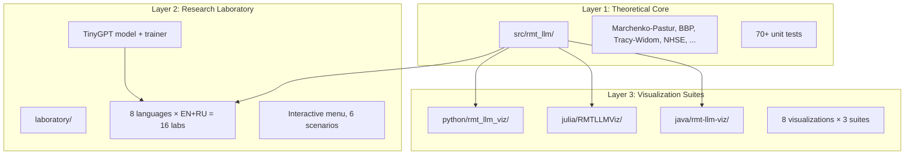
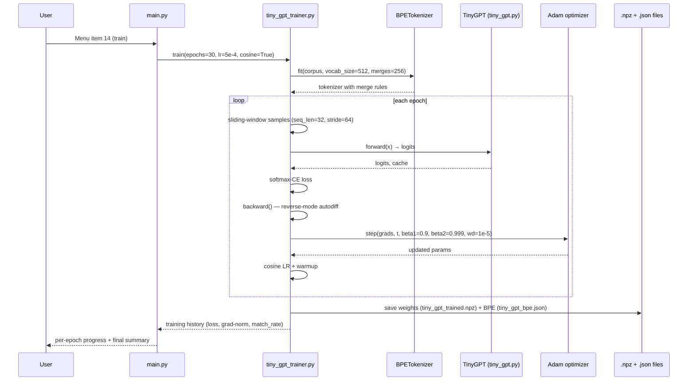

# Architecture Overview

This page gives the high-level architecture of `rmt-llm-research`. For a
deeper dive into specific topics, see:

- [Design Principles](principles.md)
- [Decision Records (ADR)](adr.md)
- [Request Flow](request-flow.md)

The original `ARCHITECTURE.md` (kept at repo root for GitHub visibility) is
mirrored here for the docs site.

---

## Three Layers of the Project

The project is organized into three layers, each with a clear responsibility:

### Layer 1 — Theoretical Core (`src/rmt_llm/`)

Pure-Python implementations of every mathematical object in the RMT-LLM
theory. **No I/O, no plotting, no CLI** — just functions and constants.

Every public function returns either a `float`, a `numpy.ndarray`, or a
`tuple` of those — no custom classes. This keeps the API trivial to port to
Julia, Java, Rust, Go, C++, and R (see Layer 2).

### Layer 2 — Research Laboratory (`laboratory/`)

The "playground" — 8 languages × 2 locales (EN + RU) implementing the same
**interactive menu** with scenario runners, experiments, charts, and reports.

**Cross-language contract:** every lab emits the **same JSON schema**. This
is enforced by `tests/test_cross_lang_json.py` which loads 16 output files
and asserts they all parse against `laboratory/shared/schema.json`.

The reference TinyGPT model and trainer live in `laboratory/python/lab_en/`.

### Layer 3 — Visualization Suites (`python/`, `julia/`, `java/`)

Three full-featured interactive suites (Python CLI, Julia REPL, Java JavaFX)
that produce 8 identical 3D visualizations each. They call into Layer 1 /
Layer 2 modules for the math and only handle rendering.

---

## Request Flow: Training TinyGPT

See [Request Flow](request-flow.md) for the full annotated walkthrough.

---

## Test Architecture

| Suite                            | Tooling        | Where                                | Count |
|----------------------------------|----------------|--------------------------------------|-------|
| RMT module unit tests            | pytest         | `src/rmt_llm/tests/`                 | 70+   |
| TinyGPT + BPE + trainer          | pytest         | `laboratory/python/lab_en/tests/`    | 101   |
| Property-based tests             | hypothesis     | `laboratory/python/lab_en/tests/test_hypothesis.py` | ~50 examples |
| Performance benchmarks           | pytest-benchmark | `laboratory/python/lab_en/tests/test_benchmark.py` | 14 |
| Cross-implementation consistency | pytest + Julia | `src/rmt_llm/tests/test_cross.py`    | 7     |
| Julia verification               | `Pkg.test()`   | `julia/RMTLLMVerify/test/`           | 18    |
| Java headless verification       | Gradle         | `java/rmt-llm-viz/...Verifier.java`  | 14    |
| Rust unit tests                  | `cargo test`   | `laboratory/rust/lab_*`              | 12    |
| Go unit tests                    | `go test`      | `laboratory/go/lab_*`                | 10    |

CI runs **all** of these on every push and PR — see
`.github/workflows/ci.yml`. The matrix covers Python 3.10/3.11/3.12 and
Julia 1.9/1.10/1.11.

---

## Security Boundaries

- **Untrusted model weights** — `model_downloader.py` only pulls from a
  hard-coded registry (`laboratory/shared/model_registry.json`). The trainer
  never deserializes user-supplied `.npz` files. Loading external weights
  requires `--trust-weights` flag and prints a warning.
- **Untrusted corpora** — BPE tokenizer operates on raw bytes; no `eval`,
  no `pickle`, no YAML `unsafe_load`.
- **CI secrets** — only `CODECOV_TOKEN` and `ZENODO_TOKEN` exist; both are
  scoped read-only. No write tokens in workflows.
- **GitHub Actions permissions** — every workflow has `permissions: {
  contents: read }` by default; only `release.yml` escalates to `contents:
  write`, and only on tagged commits.

---

## Where to make changes

| You want to…                         | Touch this                                          | Don't touch this                                |
|--------------------------------------|-----------------------------------------------------|-------------------------------------------------|
| Add a new RMT formula                | `src/rmt_llm/<module>.py` + `tests/test_<module>.py`| `laboratory/` (it consumes the package)         |
| Improve TinyGPT training             | `laboratory/python/lab_en/tiny_gpt_trainer.py`      | `src/rmt_llm/` (it's RMT, not training)         |
| Add a new 3D visualization           | `python/rmt_llm_viz/main.py` + Julia + Java ports   | `src/rmt_llm/` (math goes there, viz calls it)  |
| Translate docs to RU                 | `docs/ru/` + `laboratory/*/lab_ru/`                 | English sources                                  |
| Add a new language port              | `laboratory/<lang>/lab_en/` + `lab_ru/`             | Existing ports (mirror them exactly)            |
| Fix a CI bug                         | `.github/workflows/*.yml`                            | Source code                                      |
| Add a new test                       | `src/rmt_llm/tests/` or `laboratory/.../tests/`     | Production code (test-only change)              |
