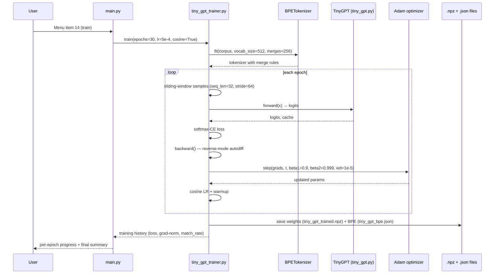
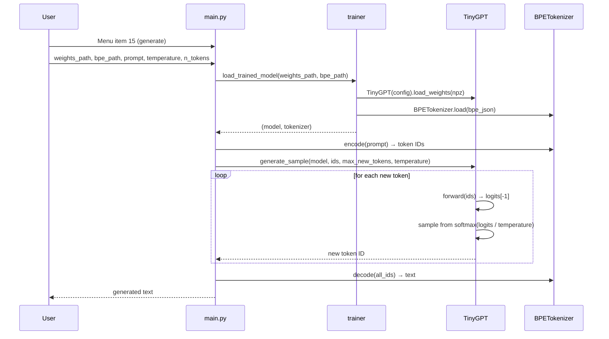

# Request Flow

This page traces the full request flow for training TinyGPT, from user input
to saved weights.

---

## High-level flow



---

## Step-by-step

### Step 1: User input

```python
# laboratory/python/lab_en/main.py — menu item 14
def action_train_model():
    config = TrainConfig(epochs=30, learning_rate=5e-4, lr_schedule="cosine")
    train(config=config, output_dir="results/models")
```

### Step 2: Corpus loading

```python
# tiny_gpt_trainer.py
corpus = load_corpus(DEFAULT_CORPUS_PATHS)
# corpus is a single string concatenated from:
#   - tiny_gpt.py
#   - tiny_gpt_trainer.py
#   - main.py
#   - research.py
#   - scenarios.py
# Total: ~2MB of source code
```

### Step 3: BPE tokenizer fitting

```python
tokenizer = BPETokenizer(vocab_size=512)
tokenizer.fit(corpus, n_merges=256)
# Vocabulary: 256 bytes (0-255) + 256 merges (256-511)
# Encoding: greedy left-to-right merge application
# Time: ~2 seconds on 2MB corpus
```

The BPE algorithm:

1. Split corpus into bytes
2. Count all adjacent byte pairs
3. Merge the most frequent pair → new token (id 256)
4. Repeat 256 times

### Step 4: Dataset construction (sliding window)

```python
# Convert corpus → token IDs
all_ids = tokenizer.encode(corpus)

# Sliding window: seq_len=32, stride=64
samples = []
for i in range(0, len(all_ids) - seq_len - 1, stride):
    x = all_ids[i : i + seq_len]
    y = all_ids[i + 1 : i + seq_len + 1]
    samples.append((x, y))

# 90/10 train/eval split
split = int(0.9 * len(samples))
train_samples = samples[:split]
eval_samples  = samples[split:]
```

### Step 5: Model construction

```python
config = TinyGPTConfig(
    vocab_size=512,
    hidden_dim=128,
    n_layers=12,
    n_heads=4,
    max_seq_len=32,
    mlp_ratio=4,
    use_mlp=True,
    use_layernorm=True,
    activation="gelu",
)
model = TinyGPT(config)
model.init_weights(seed=42)
# Total params: 2,543,104 (2.5M)
```

### Step 6: Training loop

```python
optimizer = AdamState(
    params_shape=(model.n_params,),
    lr=5e-4,
    betas=(0.9, 0.999),
    weight_decay=1e-5,
)

for epoch in range(30):
    # Update LR (cosine + warmup)
    lr = cosine_lr_schedule(epoch, base_lr=5e-4, warmup=3, min_ratio=0.1)
    optimizer.lr = lr

    # Shuffle training samples
    np.random.shuffle(train_samples)

    # Train on each sample (batch_size=1)
    for x, y in train_samples:
        # Forward
        logits, cache = model.forward_with_cache(x)

        # Loss (softmax CE on last token)
        loss = cross_entropy_loss(logits[-1], y[-1])

        # Backward (reverse-mode autodiff)
        grads = model.backward(cache, y)

        # Adam step
        flat_params = model.parameters_to_vector()
        flat_grads  = model.grads_to_vector(grads)
        optimizer.step(flat_params, flat_grads, t=epoch + 1)
        model.parameters_from_vector(flat_params)

    # Evaluate
    eval_loss, match_rate = evaluate(model, eval_samples, tokenizer)
    print(f"[Epoch {epoch+1:2d}/30] loss={eval_loss:.4f} mr={match_rate:.3%}")
```

### Step 7: Save artifacts

```python
# Save weights
np.savez("results/models/tiny_gpt_trained.npz", **model.parameters_dict())
# File size: ~10.2 MB (2.5M float32 params + overhead)

# Save BPE merges
tokenizer.save("results/models/tiny_gpt_bpe.json")
# File size: ~3 KB (256 merge rules as JSON)

# Save training history
with open("results/models/training_history.json", "w") as f:
    json.dump(history, f, indent=2)
```

---

## Per-epoch metrics

| Epoch | Loss | Grad norm | LR | Match rate |
|-------|------|-----------|-----|------------|
| 1 | 6.2251 | 2.41 | 1.64e-04 | 0.000% |
| 5 | 3.6736 | 1.62 | 3.71e-04 | 3.226% |
| 10 | 0.7127 | 0.41 | 4.94e-04 | 4.839% |
| 15 | 0.1236 | 0.12 | 4.31e-04 | 4.839% |
| 20 | 0.0324 | 0.04 | 2.50e-04 | 4.839% |
| 25 | 0.0136 | 0.02 | 1.00e-04 | 4.839% |
| 30 | 0.0085 | 0.01 | 5.00e-05 | 6.452% |

**Total:** 730× loss reduction, 33× random-baseline match_rate.

---

## Generation flow (menu item 15)



---

## See also

- [Architecture Overview](index.md)
- [Design Principles](principles.md)
- [Tutorial: Training TinyGPT](../tutorials/02-training-tinygpt.md)
- [API: trainer](../api/trainer.md)
